# 智行路线 / RouteWise

> AI 驱动的旅行与城市出行智能规划 Web 应用

把目的地探索、POI 推荐、行程生成、地图查看和实时调整放在同一个工作台里，帮助用户更快规划可执行的旅行路线。项目同时提供**桌面端 Web 工作台**与**移动端 App 页面**：窄屏（≤767px）自动进入 `/mobile` 移动端，宽屏走 `/dashboard` 桌面端。

---

## 页面截图

| 登录页 | 首页仪表盘 | 新建行程 |
|:---:|:---:|:---:|
| 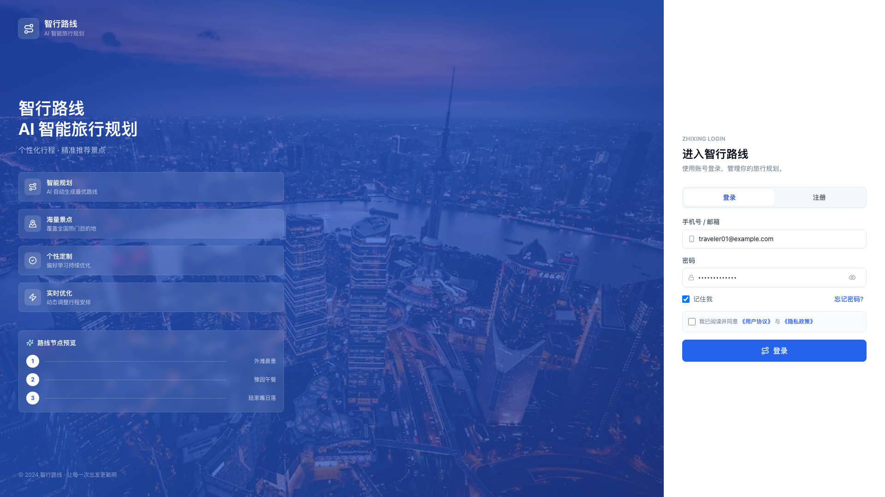 | 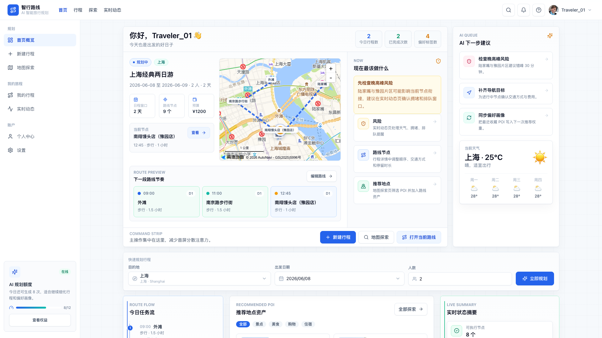 | 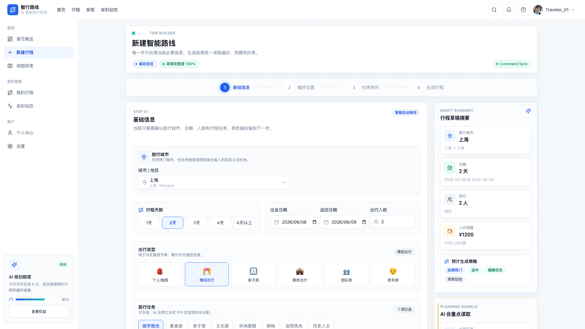 |

| 地图探索 | 行程列表 | 行程总览 |
|:---:|:---:|:---:|
| 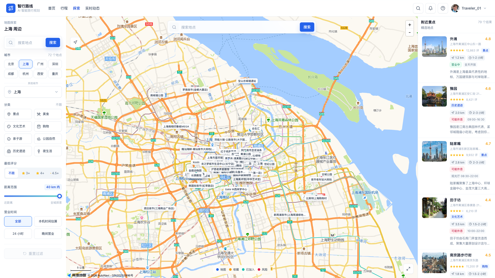 | 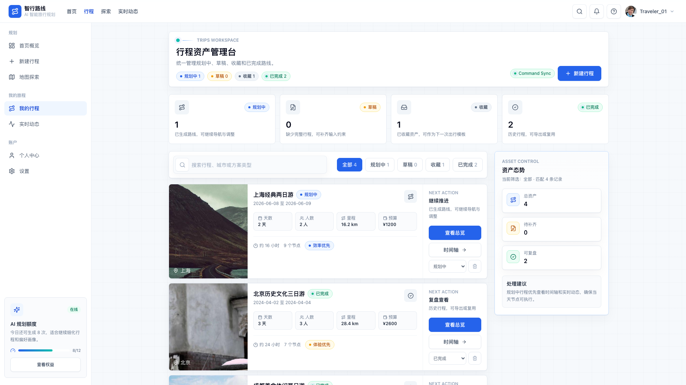 | 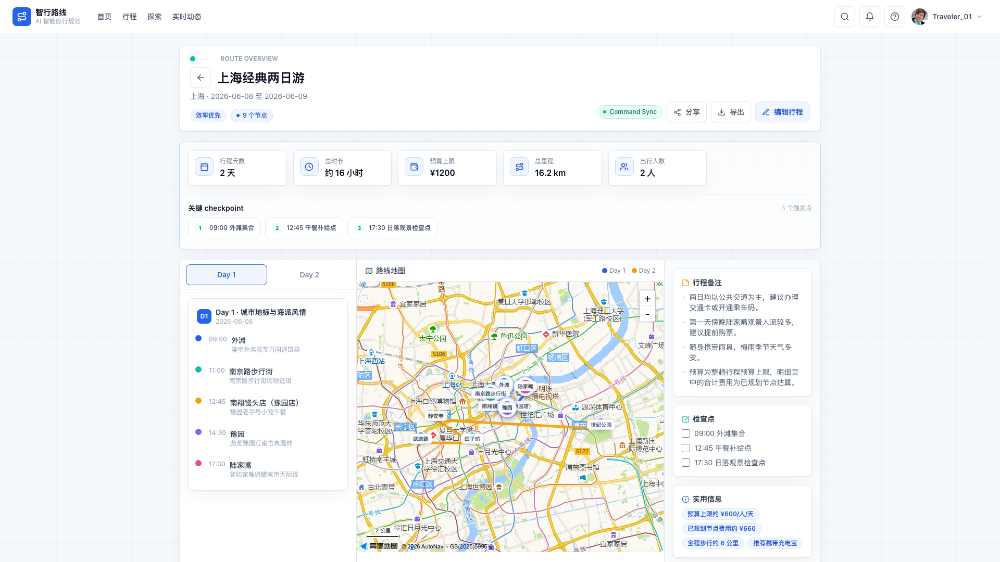 |

| 实时动态 | 个人中心 |
|:---:|:---:|
| 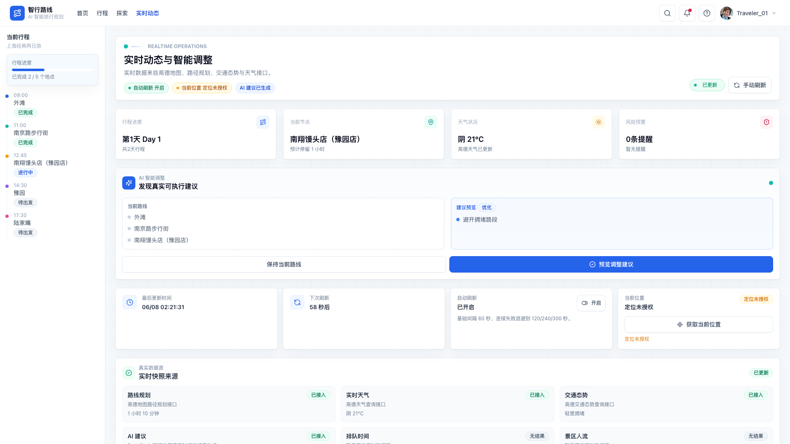 | 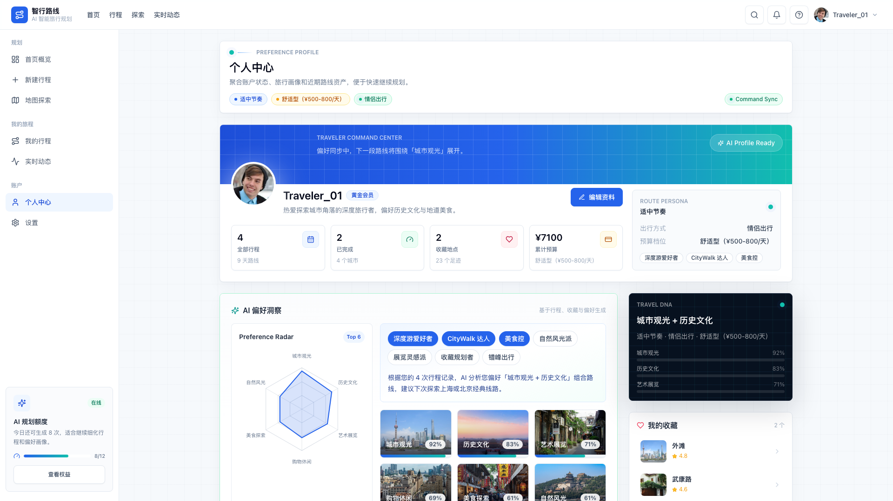 |

### 移动端页面（App 端）

窄屏（≤767px）自动进入 `/mobile` 路由，内置底部导航栏与 5 个移动端页面。

| 首页 | 行程 | 探索 |
|:---:|:---:|:---:|
| 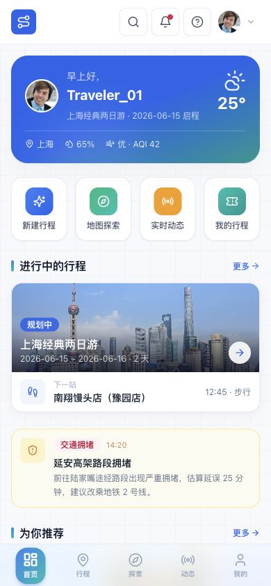 | 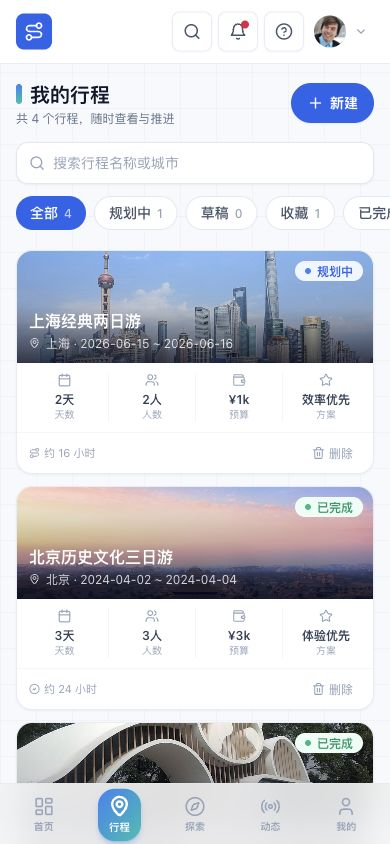 | 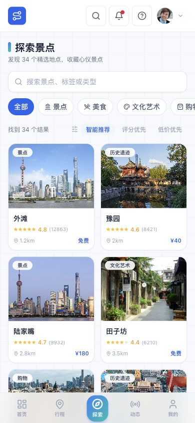 |

| 动态 | 我的 |
|:---:|:---:|
| 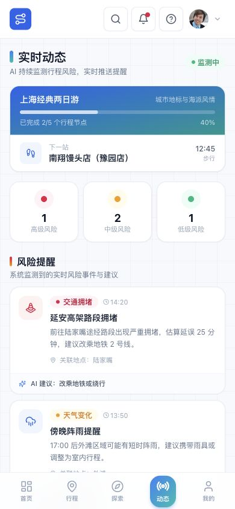 | 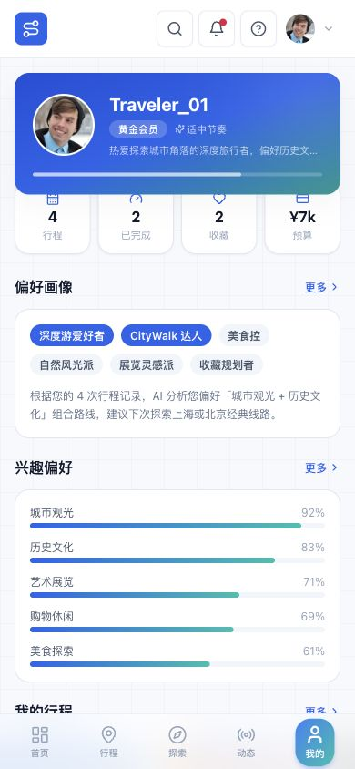 |

| 页面 | 路由 | 说明 |
|---|---|---|
| 首页 | `/mobile` | 渐变天气 Hero、宫格快捷入口、横滑推荐卡片、收藏区 |
| 行程 | `/mobile/trips` | 搜索 + 状态筛选横滑、触感行程卡、删除确认弹窗 |
| 探索 | `/mobile/explore` | 分类图标切换、排序、触屏 POI 卡片 |
| 动态 | `/mobile/realtime` | 渐变进度条行程卡、风险概览三栏、事件时间线、AI 助手入口 |
| 我的 | `/mobile/profile` | 渐变个人头部、数据指标、偏好画像、快捷链接 |

> 底部导航栏采用玻璃态毛玻璃背景 + 渐变胶囊高亮，与桌面端共用同一套品牌色系。

---

## 功能亮点

| 功能模块 | 说明 |
|---|---|
| **行程创建** | 按目的地、日期、人数、预算、兴趣偏好和交通约束，分步生成行程草稿 |
| **多套方案** | 生成效率优先、体验优先、预算优先等多套路线方案，支持并排对比 |
| **地图探索** | 查看城市 POI（景点、餐厅、商圈）分布，支持分类、评分、距离、营业时间筛选 |
| **行程管理** | 行程总览、地图视图、时间轴详情和历史行程列表一体化管理 |
| **实时调整** | 结合高德路径规划、天气、交通态势提示风险，AI 给出可执行调整建议 |
| **智行助手** | 基于当前行程和实时数据回答问题，暂无数据时明确说明 |
| **偏好画像** | 沉淀兴趣、餐饮偏好、节奏和预算等级，用于后续推荐优化 |
| **导航集成** | 支持唤起高德地图发起实时导航 |
| **导出分享** | 行程可导出为 Markdown 文件或通过系统分享面板分享 |

---

## 技术栈

- **前端框架**：Vite 8 + React 18 + TypeScript 5
- **样式**：Tailwind CSS 3
- **路由**：React Router 6
- **图标**：lucide-react
- **地图**：高德地图 JS API（`@amap/amap-jsapi-loader`）与 Web Service
- **本地 Agent**：Node.js ESM HTTP 服务，提供路线生成、问答、POI 搜索和实时状态接口
- **AI 能力**：可配置 DeepSeek 或美团 LongCat；未配置时走本地降级逻辑

---

## 快速开始

### 安装依赖

```powershell
npm install
```

### 配置环境变量

```powershell
Copy-Item .env.example .env
```

按需填写 `.env` 里的高德地图、Agent 和 LLM 配置。

### 启动服务

```powershell
# 终端 1：启动本地 Agent（提供路线、天气、POI 等接口）
npm run agent

# 终端 2：启动前端开发服务
npm run dev
```

浏览器访问 [http://localhost:5173](http://localhost:5173)，使用演示账号登录：

> 账号：`traveler01@example.com` 密码：`routewise2024`

### 常用检查命令

```powershell
npm run typecheck          # TypeScript 类型检查
npm run lint               # 完整 lint（含服务端脚本语法检查）
npm run build              # 构建生产产物
npm run smoke              # 冒烟测试（检查端口与接口连通性）
npm run validate:production-data  # 生产数据质量检查
```

---

## 环境变量

主要配置项见 `.env.example`。`VITE_*` 变量会进入浏览器产物，只能放公开配置或本地演示值。

| 变量 | 可见范围 | 说明 |
|---|---|---|
| `VITE_AMAP_KEY` | 浏览器可见 | 前端高德地图 JS API Key |
| `VITE_AMAP_SECURITY_CODE` | 浏览器可见 | 前端高德 JSAPI 安全密钥 |
| `VITE_AGENT_API_BASE_URL` | 浏览器可见 | 前端访问 Agent 的地址 |
| `VITE_AGENT_AUTH_MODE` | 浏览器可见 | `demo`（本地）或 `production`（生产） |
| `VITE_AGENT_API_TOKEN` | 浏览器可见 | 仅本地 demo 使用；生产必须留空 |
| `AGENT_AUTH_MODE` | 服务端私有 | Agent 认证模式：`demo` 或 `production` |
| `AGENT_PRODUCTION_AUTH_READY` | 服务端私有 | 生产认证边界确认开关；接入真实认证或可信网关后设为 `1` |
| `AGENT_API_TOKEN` | 服务端私有 | Agent 服务端校验 Token；生产不得与 `VITE_AGENT_API_TOKEN` 相同 |
| `LLM_PROVIDER` | 服务端私有 | LLM 提供方：`deepseek` 或 `longcat` |
| `LLM_MODEL` | 服务端私有 | 模型名称；DeepSeek 默认 `deepseek-v4-flash`，LongCat 默认 `LongCat-2.0-Preview` |
| `DEEPSEEK_API_KEY` | 服务端私有 | DeepSeek 密钥 |
| `DEEPSEEK_BASE_URL` | 服务端私有 | DeepSeek 接口地址，默认 `https://api.deepseek.com` |
| `LONGCAT_API_KEY` | 服务端私有 | 美团 LongCat 密钥 |
| `LONGCAT_BASE_URL` | 服务端私有 | LongCat 接口地址，默认 `https://api.longcat.chat/openai/v1` |
| `AMAP_WEB_SERVICE_KEY` | 服务端私有 | 服务端调用高德 Web Service 的密钥 |

> **生产注意**：`NODE_ENV=production` 或 `AGENT_AUTH_MODE=production` 时仍使用 demo token，服务端会拒绝启动，`npm run check:env` 也会失败。

切换到美团 LongCat：

```powershell
LLM_PROVIDER=longcat
LLM_MODEL=LongCat-2.0-Preview
LONGCAT_API_KEY=your-longcat-api-key
LONGCAT_BASE_URL=https://api.longcat.chat/openai/v1
```

---

## 项目结构

```text
src/
  components/
    layout/          AppLayout、TopNav、BottomNav、Sidebar
    ui/              Card、Tag、Stars、Toast、Modal、CitySelect、DatePicker、RouteSystem 等
    AMapCanvas.tsx   高德地图真实渲染
    MapCanvas.tsx    SVG 地图（演示模式）
  mock/              演示城市、POI、行程、天气、用户数据及生成 POI 分片
  pages/
    Login.tsx        登录 / 注册
    Dashboard.tsx    首页仪表盘
    Explore.tsx      地图探索（支持本地 + 远程 POI 搜索）
    PoiDetail.tsx    景点详情
    Trips.tsx        行程列表
    TripOverview.tsx 行程总览
    TripDetail.tsx   时间轴详情
    Realtime.tsx     实时动态与智能调整
    Profile.tsx      个人中心
    Settings.tsx     设置页
    newtrip/         新建行程分步流程（基础信息、偏好、约束、生成、方案对比）
    Mobile*.tsx      移动端 App 页面（MobileHome/Trips/Explore/Realtime/Profile，走 /mobile 路由）
  services/          Agent、定位、大众点评、通知和实时状态服务
  store/             AppContext 全局状态
  types/             完整 TypeScript 类型定义
  utils/             图片处理、高德导航、浏览器动作、行程构建与突变工具

server/
  agent-server.mjs   本地 Agent（路线生成、POI 搜索、实时快照、问答）
  data-layer.mjs     数据层（生产数据源 SourcedField 契约）

scripts/
  smoke.mjs                      冒烟测试
  check-env.mjs                  环境变量完整性检查
  check-secrets.mjs              密钥合规检查
  check-poi-images.mjs           POI 图片审核
  collect-city-pois.mjs          城市 POI 数据采集
  build-generated-pois.mjs       生成 POI 分片数据
  validate-pois.mjs              POI 数据校验
  validate-production-data.mjs   生产数据质量检查

data/
  generated-pois.json            本地 POI 主数据
  runtime/                       运行时快照与审计日志（gitignore）
```

---

## 最近更新

- **移动端 App UI 升级**：5 个移动端页面（首页 / 行程 / 探索 / 动态 / 我的）全面升级视觉精致度，新增 `index.css` 移动端设计辅助类（`glass-nav`、`hero-glow`、`m-card`、`touch-press`、`text-gradient-brand`），底部导航升级为玻璃态 + 渐变胶囊高亮
- **错误边界**：新增 `AppErrorBoundary` 类组件，页面崩溃时展示友好错误提示，并提供"返回首页"恢复入口
- **SEO 优化**：`index.html` 补充 `meta description` 与 `theme-color` 标签
- **中文 UI 修复**：行程卡片天数标签从 `D1` / `D2` 改为 `第1天` / `第2天`，符合中文阅读习惯
- **构建优化**：`vite.config.ts` 上调 `chunkSizeWarningLimit` 至 5000 KB，消除 POI 区域数据分片的误报警告

---

## 生产数据源架构

生产模式下，前端不使用 `src/mock/*` 或 `data/generated-pois.json` 作为事实源。生产事实由 Agent 的 `/api/data/*` 接口返回，并使用字段级 `SourcedField` 契约记录 `sourceProvider`、`sourceEndpoint`、`sourceId`、`fetchedAt`、`expiresAt`、`confidence`、`stale`、`unavailableReason` 和 `rawSnapshotId`。

数据分为五层：

| 层级 | 说明 |
|---|---|
| `authoritative_static` | 权威静态数据（如城市基础信息） |
| `provider_snapshot` | 第三方服务快照（高德、大众点评） |
| `realtime_observation` | 实时观测数据（路况、天气） |
| `derived_recommendation` | AI 推导推荐（仅基于已验证事实） |
| `demo_mock` | 演示模拟数据（仅开发/演示环境） |

天气、路径规划和交通态势使用短 TTL；过期数据只能显示为"已过期/仅供参考"；排队、人流、票价和营业状态没有可信来源时必须显示未知或待确认。LLM 只能基于已验证事实做排序、摘要和推荐理由，不能生成未验证数据。

运行时快照默认写入 `data/runtime/provider-snapshots/`，审计日志写入 `data/runtime/audit-log.jsonl`，可通过 `rawSnapshotId` 追溯。详细方案见 [docs/production-data-source-architecture.md](./docs/production-data-source-architecture.md)。

---

## 当前状态

该项目以演示和原型验证为主，已包含：

- ✅ 完整前端页面链路（桌面端 11 个页面 + 移动端 5 个页面，含分步流程）
- ✅ 移动端 App 端自适应（窄屏自动切换 `/mobile` 路由，含底部导航与触感交互）
- ✅ 本地 Agent 接口（路线生成、POI 搜索、实时快照、智能问答）
- ✅ 全局错误边界，页面崩溃有友好恢复入口
- ✅ 安全边界检查（密钥合规、环境变量校验、生产 token 隔离）
- ✅ TypeScript 全量类型覆盖
- ✅ 基础构建验证与冒烟测试

正式生产部署前，还需要补充：

- ⬜ 真实用户认证体系（替换 demo token）
- ⬜ 持久化数据存储（替换浏览器本地状态）
- ⬜ 多实例限流与更完整的后端权限控制
- ⬜ 完整 E2E 测试覆盖
