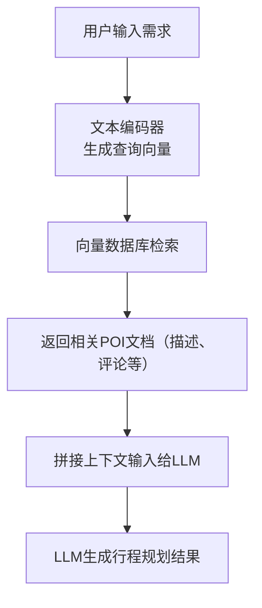

# 执行摘要

本报告针对本地化智能路线规划系统的设计与实施提出了全面方案。系统目标是根据用户旅行/出游目标，结合兴趣点(POI)数据库、用户生成内容(UGC)评论与用户偏好，自动生成可执行的多约束个性化路线。方案涵盖了场景分析、数据源采集、数据建模与存储、检索增强生成(RAG)架构、本地化大模型与检索模型选择、多约束路径规划算法、多目标优化策略、个性化用户建模与动态调整、评估指标和测试设计、系统性能需求以及隐私安全等方面。报告还给出了候选方案比较表、示例数据模式、示例Prompt模板、RAG流程图和评估方案，提供了项目实施路线图、里程碑、交付物、工期和成本估算等信息。所有观点均引用了权威中文资料和相关研究，以确保方案科学严谨。  

## 系统目标与用户场景

面向旅行者或出游用户，系统应实现“给出需求→生成完整行程”自动化流程。核心目标包括：**个性化**（优先满足用户兴趣和偏好）、**多约束**（考虑时间、费用、开闭馆时间等约束）、**动态调整**（实时交通与突发情况）、**高效可执行**（路线空间连贯，尽量减少往返冗余）等。当前研究指出，在海量信息背景下，“如何帮助游客快速制定个性化游览路线并提升旅行体验”是旅游路线规划的关键【40†L1-L4】；更具体地，路线规划问题的目标是：在满足用户时间和费用等约束条件下，选择尽可能匹配用户偏好的兴趣点，使游客满意度最大化【40†L13-L17】。  

用户场景示例包括：  
- **城市一日游/半日游**：用户给出城市、兴趣（美食、文化、休闲等）、可用时间/预算，系统需综合停车/交通时间，生成最优路线。  
- **主题旅行**：如美食游、博物馆游，系统需筛选相关POI（包含菜单/价格信息、评分），并考虑地点分布与耗时。  
- **休闲购物娱乐**：涉及商场、剧场、娱乐设施等，加入实时排队/等待因素。  
- **特殊需求**：如亲子游（适合儿童项目）、无障碍游（无障碍设施、轮椅可达）等。  

系统需兼顾用户显式偏好（食物种类、景点类型、预算范围等）和隐式偏好（历史行为、兴趣画像），并根据实时数据（交通拥堵、天气、活动等）动态调整行程。用户可能通过手机应用或聊天对话方式提供需求，如：“我想在上海两天游览，喜欢川菜和博物馆，预算XXX元”。系统返回包含POI列表及优化行程路线。根据旅游路线规划综述，成功的方案应打破传统固定起终点假设，灵活支持任意起点/终点、上下文感知（如天气、季节、交通）【42†L372-L375】【42†L357-L362】。

## 数据源与数据整合

系统需要丰富、多样的数据：包括**POI元数据**（名称、类别、经纬度坐标、详细描述、联系方式等）、**开放时间**、**交通时长**、**实时路况**、**UGC评论与评分**、**菜单与价格**、**图片**等。推荐数据源及说明如下：  

- **官方地图API**：国内主流地图服务如高德地图、百度地图、腾讯地图提供完整的POI数据库、坐标、地址和类别信息。高德开放平台官方文档指出，高德提供了千万级别的POI数据【10†L19-L21】；FineReport分析认为，高德和百度在中国大陆地区POI覆盖率高，数据更新频率日常级，实时交通能力领先【12†L57-L64】。**推荐使用**高德地图Web/SDK接口（查询POI、地理编码、路线规划、实时路况等）和腾讯地图API等作为POI元数据和基础服务来源。  
- **开放数据集/合作数据**：参考「2018年百度与高德全国POI数据集」资料，POI数据通常含坐标、类别/子类别、名称、地址、联系方式，有时附带图片、用户评论和评分【8†L91-L94】。可利用此类公开数据集进行离线分析或填充（仅供示例）。也可考虑OpenStreetMap等开源全球数据作为补充。  
- **UGC评论与评分**：利用**大众点评**、**马蜂窝**、**携程点评**等平台的用户评论和评分。大众点评平台上，店铺页面常含有用户评论、评分及菜品价目表【19†L220-L224】。如上文所引，大众点评的菜品“推荐价”是基于用户信息计算而来【19†L220-L224】，表明该平台具备餐饮菜单和价格信息。马蜂窝等专注景点的社区也有丰富游记与点评。通过爬虫或官方SDK获取这些评论，可以构建POI的用户反馈特征（如好评率、热议标签等）。  
- **实时交通与时长**：使用地图API的路径规划接口获取**驾车/步行/公交时长**。高德、百度、腾讯均提供多模式路径规划，可以返回旅行时长和距离；其中高德在实时路况预测和避堵方面领先【12†L61-L64】。此外可调用高德路况查询API获取区域交通拥堵情况，用于动态调整路线。  
- **其他属性**：包括门票价格、菜单价格、商家营业时段等。前述大众点评餐厅页面即提供价目表，可定期抓取或通过接口获取【19†L220-L224】；POI照片可从地图服务或社交媒体获取，帮助行程展示。  

### 数据融合与存储

采用结构化数据库（如MySQL、PostGIS）存储POI基本属性和关系型数据，便于查询和空间索引【8†L98-L103】。同时，对文本内容（评论、描述）使用文本嵌入并存入向量数据库。基于检索增强生成（RAG）架构，我们需先对语料（POI信息、UGC评论）进行分段向量化存储，便于语义检索。  

示例**POI数据模式**（JSON）：
```json
{
  "poi_id": 12345,
  "name": "故宫博物院",
  "category": "博物馆/历史文化",
  "latitude": 39.916,
  "longitude": 116.397,
  "address": "北京市东城区景山前街4号",
  "opening_hours": "8:30-16:30",
  "rating": 4.7,
  "price": 60,
  "tags": ["故宫","历史","文化"],
  "reviews": [
      {"user": "张三", "rating": 5, "text": "值得一游，需要半天时间。"},
      {"user": "李四", "rating": 4, "text": "展品丰富，游客较多，需要排队。"}
  ],
  "image_urls": ["http://.../gong1.jpg", "http://.../gong2.jpg"]
}
```
示例**用户画像数据模式**（JSON）：
```json
{
  "user_id": 987,
  "age": 30,
  "profile": {
    "preferred_categories": ["博物馆", "美食"],
    "cuisine_preference": ["川菜", "粤菜"],
    "budget_level": 200,
    "accessibility_needs": false
  },
  "history": {
    "visited_pois": [12345, 67890],
    "travel_frequency": 0.5
  }
}
```

上述数据模型捕获了兴趣点的地理属性、类别、营业时段、价格、用户评价等关键信息，以及用户偏好（喜欢的类别、预算、已访问记录等）【40†L13-L17】【42†L357-L362】。在存储时，可将评论文本通过预训练中文句向量模型（如汉语Sentence-BERT、SimCSE等）编码成向量，存入向量数据库（Milvus、Qdrant等），用于后续检索【21†L73-L82】【22†L29-L42】。

## 本地化大模型与检索架构

系统采用**检索增强生成(RAG)** 架构：先通过检索模型（Embedding + 向量数据库）选出与用户需求最相关的POI及描述，然后将相关文本与用户输入一起传入本地化大模型进行生成。该模式既保证了信息来源的可靠性，又利用了LLM的推理生成能力。

### 本地大模型候选与对比

考虑到需要支持中文且可本地部署的模型，候选包括：  
- **ChatGLM 6B/ChatGLM2 6B**：清华智谱发布的中文对话模型。ChatGLM2-6B支持8K上下文，对话自然流畅，可量化至INT4运行在6GB显存环境【29†L103-L108】。适合低显存环境和基本中文问答生成。  
- **Baichuan**：搜狗出品，提供7B/13B等版本，具备中文推理能力。Baichuan-7B可嵌入中等硬件。  
- **Qwen**：腾讯出品，支持中英双语对话，有7B/14B/33B等版本，其中Qwen-7B-Chat为对话版，可在单卡上运行，14B/33B需GPU集群。其3.5系列支持更大上下文。  
- **LLaMA 相关中文模型**：OpenLLaMA、Ziya-LLaMA等经过中文增训，7B-13B可用于本地部署。  
- **MOSS/混元** 等新模型：具备多轮对话能力，但规模较大，对算力需求高。  
- **小模型做检索**：检索时可使用较轻量级句向量模型（如bert-base-chinese做embedding）生成向量。  

以下表格总结了部分模型的参数量、显存需求和适用场景等：

| 模型               | 参数量  | 量化后显存需求（最低） | 主要特性                           | 适用场景         |
|:------------------:|:-------:|:----------------------:|:---------------------------------:|:---------------:|
| ChatGLM-6B         | ~6B     | INT4: ~6GB【29†L103-L108】| 中文对话优化，轻量部署；低显存对话    | 移动端/嵌入式  |
| ChatGLM2-6B        | ~6B     | INT4: ~5.5GB【29†L103-L108】| 支持8K上下文，多轮对话；速度快       | 高对话上下文    |
| Baichuan-7B        | ~7B     | FP16: ~13GB            | 中文强劲理解/生成                   | 中小型GPU      |
| Qwen-7B-Chat       | 7B      | INT4: ~?               | 中英双语对话，腾讯开源               | 单卡GPU       |
| Qwen-14B-Chat      | 14B     | FP16: ~30GB            | 增强推理，多任务能力                 | 多卡服务器    |
| LLaMA-based 7B     | 7B      | INT8: ~8GB             | 通用小模型，需中文增训版本          | 开源社区/研究  |
| **向量检索模型**   | —       | —                      | 例如句向量模型（SimCSE/ERNIE等）     | 生成文本前检索 |

选择建议：开发/验证阶段可选轻量模型（如ChatGLM2-6B）快速迭代；生产或大规模应用阶段可迁移至大模型（如Qwen-14B、Baichuan-13B）以提升生成质量。可采用**LoRA微调**针对旅行领域数据或用户群体进行快速定制，同时利用INT8/INT4量化技术降低显存要求【29†L103-L108】。部署方式上，可将模型集成在本地服务器或边缘设备中，确保用户数据不离线、遵守隐私。

### 检索架构与向量数据库

检索模块负责根据用户查询从文档（POI信息、评论等）库中召回相关内容。实现方法为：将POI描述、评论等文本划分文段，用预训练中文embedding模型（如`sentence-transformers/multi-qa-mpnet-base-chinese`）编码后存入**向量数据库**。用户查询经同模型编码后，与数据库相似度检索出Top-K段。为了支持海量数据检索，应选用专业向量数据库。常见选型包括：  

| 向量数据库 | 定位                    | 部署方式            | 适用规模     | 特点/推荐场景                             |
|:----------:|:----------------------:|:------------------:|:-----------:|:----------------------------------------:|
| **Chroma**  | 轻量级嵌入式          | 进程内或独立服务   | ≤10万向量   | 零配置简易使用，与LangChain集成佳；适用于POC、小规模验证【21†L119-L127】。 |
| **Qdrant**  | 高性能云原生          | Docker/K8s等       | 10万-1000万 | Rust编写，支持复杂过滤（标签、时间等），检索延迟低；生产环境热门选择【21†L126-L134】【22†L29-L42】。 |
| **Milvus**  | 企业级分布式          | Kubernetes/集群    | ≥千万级     | 分布式高可用，支持多种索引（IVF、HNSW、DiskANN）；适合超大规模检索【21†L133-L138】【22†L29-L34】。 |
| **PGVector**| PostgreSQL 插件       | 与Postgres共存     | ≤百万级     | 复用现有Postgres，无需新组件；适合已有Postgres基础的项目【21†L140-L145】。 |
| **Pinecone**| 云托管服务            | SaaS              | 动态伸缩     | 全托管模式，自动扩容备份；快速部署小团队可选【22†L35-L42】（付费）。 |
| **Weaviate**| 云原生加元数据支持    | Docker/K8s         | 万级-千万   | 开源企业级，支持文本、向量和结构化混合检索；社区活跃。 |

综合考虑：原型阶段可用Chroma快速验证，随后推荐Qdrant部署单机版检索；大规模或多租户生产环境可选Milvus或Weaviate分布式方案【21†L133-L138】【22†L29-L42】。Pinecone等云服务非本地方案，若强调本地化则不优先。  

### Prompt 设计与RAG流程

检索结果与用户输入一起用于**生成LLM提示**。例如，系统可构造如下模板：  
```
“你是旅行路线规划助手。用户要求：{用户输入需求}。根据下面召回的兴趣点信息和约束条件，生成一个详细的旅行行程。\n约束条件：{时间预算}，{费用预算}，{主题偏好}，{开放时间}{...}。\n候选景点信息：{检索到的POI描述列表}。\n请给出有序的行程安排，并说明每个景点停留时间估计。”
```  
提示中可采用**Chain-of-Thought**（链式思维）技术引导模型分步考虑约束，如“首先分析用户总时间，划分行程天数，然后按地理位置聚类景点，再考虑开放时间排序，最后生成文本描述”。  

下图展示了示例RAG查询流程：  



实际系统中，可将此流程嵌入接口或对话框。例如用户输入对话：“帮我规划三亚三日游，喜欢海鲜与海岛活动”，系统检索相关餐厅与景点信息，再由LLM综合生成可执行路线。RAG模式保证规划依据真实信息（如景点开放时段）【5†L92-L97】【42†L372-L375】。  

## 多约束路线生成算法

路线生成是核心算法难点，需同时满足多种约束：  

- **时间窗口**：每个POI仅在其开放时间内可访问。路径规划必须在限定时间段访问景点【47†L1-L3】。  
- **旅行时间预算**：用户总可用时间（如1天8小时）限制。算法需计算行进时间、停留时间总和不超预算。  
- **费用/预算**：总费用或各类费用（交通、门票、餐饮）限制。可选景点集合时考虑价格标签。  
- **兴趣偏好**：用户对景点类型、餐饮口味、主题偏好等。偏好高的POI应优先纳入推荐【40†L13-L17】。  
- **饮食需求**：若包括餐厅行程，需要考虑菜系、价格水平、菜单价格等（如通过大众点评菜价【19†L220-L224】筛选）。  
- **可达性**：若考虑无障碍需求，筛掉无无障碍设施的景点。  
- **排队/等待**：可估算热门景点的平均等待时间，并在总时间规划中预留（略估）。  
- **资源限制**：如车辆数、人员车流容量。  

这些问题归类为带约束的路线规划或车辆路径问题（VRP）。若只有一辆“车”，即旅行推销员问题(TSP)；多辆或多次出行则为VRP。Google OR-Tools中示例就对VRP引入了时间窗口、容量等约束【37†L159-L164】【47†L1-L3】。常见求解策略包括：  

- **精确优化（ILP/CP）**：对路线规划建整数线性规划模型，用CP-SAT、CPLEX、Gurobi等求解器解决。优点求解精确，缺点对大规模问题计算量大。OR-Tools Routing库即可建模TSP/VRP时间窗问题，适用于中小规模【37†L159-L164】【47†L1-L3】。  
- **启发式/元启发式**：使用蚁群算法、遗传算法、模拟退火等对模型进行启发式求解。例如已有研究将蚁群与帕累托多目标结合，综合考虑空间距离、天气、交通等因素，生成接近Pareto最优的旅游路线【44†L125-L133】。其他方法如局部搜索、禁忌搜索等也常用于旅行规划问题。  
- **分层/分块规划**：先按区域或类型对POI进行聚类，再在每个簇中求最优子路由（类似分治策略）。  
- **多目标优化**：很多场景下需同时优化多个目标（最短时间、最大满意度、最小费用等）。可采用NSGA-II等多目标进化算法，或寻找帕累托前沿解。已有工作表明，多目标设置（如路线评分、景点数、时间成本）可比较产生TOP-K帕累托最优路线【43†L1-L9】。 

针对中国环境，可选用成熟库：**OR-Tools**（CP-SAT + Routing库，支持时间窗等）可处理复杂约束；**PuLP**/**Pyomo**等搭配CBC/Gurobi求ILP；**DEAP**、**inspyred**等遗传算法库用于自定义启发式。下表比较了常见优化库：  

| 库/算法            | 类型            | 优势                    | 局限                      | 推荐场景           |
|:------------------:|:--------------:|:-----------------------:|:------------------------:|:----------------:|
| OR-Tools Routing   | CP-SAT (Google) | 开源免费；内置TSP/VRP模型；支持时间窗、容量等约束【47†L1-L3】 | 对超大实例求解时间长    | 中小型工业级优化 |
| Gurobi/CPLEX       | 商业ILP求解器    | 解最优精确；支持复杂约束  | 需付费授权；大实例内存高 | 需要最优解时使用 |
| Pyomo+CBC          | ILP库+开源求解器 | 成本低；灵活建模        | 性能较弱；不适超大规模   | 快速验证         |
| 遗传算法/蚁群     | 元启发式         | 可并行；易拓展多目标     | 无最优性保证；参数需调    | 大规模问题近似   |
| 禁忌搜索/局部搜索 | 启发式         | 简单有效；结果稳定       | 易陷局部最优；需调参      | 刚需快速可行解   |

上述算法可混合使用：如先用ILP确保主要约束，再用启发式优化满足多目标；或先遗传生成Pareto方案集，再用ILP局部优化。根据约束复杂度和规模，可灵活选型或分阶段求解【47†L1-L3】【40†L13-L17】。

## 个性化建模与动态调整

系统需构建每个用户的个性化画像，并基于历史行为挖掘隐式偏好。除了用户填写的明确偏好（兴趣景点类别、餐饮要求等），还可从其历史数据（签到记录、GPS轨迹、过往评价）中学习。例如，有研究使用用户历史GPS挖掘旅行习惯，并结合协同过滤和朴素贝叶斯生成符合用户习惯的路线，同时对冷启动用户用通用偏好近似【40†L25-L29】。为避免冷启动，可采用群体偏好基线（新用户取平均偏好）【40†L25-L29】。此外，将用户画像分层：**长期偏好**（常去景点类型、平均预算）与**实时偏好**（今日兴趣、当下时间等）分开建模，可在用户反馈或环境变化时动态调整。  

动态调整方面，系统应支持实时再规划。当检测到偏差时（例如交通拥堵导致行程延误，用户在某点停留超时），路线应即时修正。文献指出，用户行为导致的动态性不可忽视：如“当用户在某景点逗留时间过长时，其后续游览点的概率分布可能发生变化”【42†L329-L332】。因此，可在行程中插入检查点，如根据实时GPS判断是否延误、根据排队时间调整后续访问顺序、或在天气突变时推荐替代景点。此外，旅游动态常涉**上下文信息**：系统应获取当前天气、季节、节假日等信息，作为推荐决策依据。研究认为，将天气、位置、季节等上下文融入建模，可显著提高推荐准确性【42†L372-L375】【42†L357-L362】。

## 评估指标与测试设计

评估方面，应设计离线与在线两种方案：  

- **离线评测**：构建或利用已有旅游行程数据集（如公开CityWalk行程数据【1†】或自行标注的POI集合与出行目标），使用如BLEU、ROUGE等指标以及专门设计的路线评估指标来比较生成路线与真实路线匹配度。参考ITINERA方法，可使用**POI召回率(RR)**度量推荐POI覆盖用户实际选择的程度，**路线长度比例(AM)**比较生成路线长度与最短路径长度，**交叉点次数(OL)**衡量路线是否冗余绕行，以及**未知POI比例(FR)**评估是否推荐冷门景点【5†L92-L97】。此外，利用精细化指标如覆盖率、连通性、最短距离偏差等。可绘制折线图对比不同算法在以上指标上的表现（如图示召回率随优化迭代的变化、不同算法的Pareto前沿图）。  

- **生成质量**：使用LLM自动评估或人工打分评价路线描述的连贯性与准确性，以及是否符合用户需求。例如，邀请专家或真实用户对生成行程的可行性、合理性、用户满意度进行打分。ITINERA实验中，使用用户/专家评估路点质量、行程质量和匹配度，LLM生成方案显著优于对比模型【5†L99-L104】。同样可设计用户调研或A/B测试，对比有无此系统辅助时的用户体验和满意度。  

- **在线A/B测试**：若系统投入使用，可将目标用户随机分组，一组使用智能路线推荐，另一组使用传统导航，指标包括点击率、停留时长、路线完成率、用户反馈等。重点观察系统推荐路线的实际遵循率、用户反馈情感（正负意见）与业务指标。  

- **性能与可扩展性**：监测系统响应延迟、吞吐量和资源消耗。如每次生成一条线路所需时间，应控制在可接受范围（几秒级）。可画出响应时间随用户并发数或数据规模的增长曲线，以评估可扩展性。  

## 隐私与本地部署限制

本系统强调**本地部署**，避免向外部云端发送用户行程和偏好等隐私数据。LLM和检索组件应运行于本地服务器或用户终端，用户数据只在本地存储和计算。可能采取的策略包括：仅使用开放数据和用户授权的数据来源；对敏感输入进行脱敏；仅在设备端进行模型推理。硬件可采用**本地服务器/工作站**（如配备多卡GPU的机房服务器）或**边缘设备**（高性能PC）。假设项目初期用户量中等，可用一台8卡GPU服务器部署模型和向量库；后续根据用户增长增设节点。  

## 实施路线图

推荐分阶段实施：  

1. **M1（1-2月） 数据收集与预处理**：注册各API，批量抓取或购买POI与评论数据，清洗去重，构建数据库。输出：POI数据库及示例数据集。  
2. **M2（2-3月） 检索原型搭建**：选定向量库（如Chroma/Qdrant），构建文本索引。实现简单检索界面：输入关键词返回相关POI信息。输出：可运行的检索引擎。  
3. **M3（3-5月） 路径优化算法开发**：建立多约束模型。使用OR-Tools或自研启发式，开发基于用户输入和检索结果的路由生成模块。输出：能在给定POI集合上生成合理路线的算法服务。  
4. **M4（5-6月） LLM集成与RAG**：选定本地LLM模型，微调（或LoRA）旅游领域知识。实现RAG管道：检索结果+用户输入构造Prompt，生成行程描述。输出：端到端路线推荐Demo。  
5. **M5（6-8月） 个性化与动态调整**：加入用户画像模块，支持用户登录。根据历史偏好调整检索权重；引入实时交通、天气接口，测试在线重规划效果。输出：增强版可实时响应的系统。  
6. **M6（8-10月） 测试评估与优化**：设计离线测试集和A/B测试框架，收集用户反馈。优化算法参数和提示，修复Bug。输出：全面评测报告和最终系统。  

### 里程碑与交付物

- **M1：数据集与schema** – 输出POI数据集、用户画像样本、MongoDB/MySQL样表。  
- **M2：检索服务** – 文本检索API、向量数据库部署文档。  
- **M3：路线规划模块** – 约束模型源码与优化结果示例，算法性能报告。  
- **M4：RAG演示** – 可用聊天界面或API，输入输出样例以及Prompt文档。  
- **M5：个性化系统** – 完整用户模型服务、动态调整策略说明。  
- **M6：评估报告** – 包含离线测试结果、用户研究反馈、性能分析、最终建议。  

### 工期与成本估算

假设一个小型开发团队（3-5人），按照上述计划，预计总工期**8-10个月**。硬件投入：一台8卡GPU服务器（估计数万元）、存储设备（存储文本和嵌入向量）。软件成本主要在人力，利用开源工具可节约许可费。若考虑云替代，则需运行量预估后购买相应GPU计算资源。总成本（含人力）粗算在几百万元人民币量级。  

**假设说明**：硬件使用8×A100 GPU，本地部署；初始用户基数数千，数据规模百万级POI；具体规模和成本视项目演进调整。  

## 参考资料

本报告依据上述国内权威论文和技术文档编写，包括旅游路线规划综述【39†L65-L69】【40†L13-L17】、ITINERA路线规划研究【4†L49-L55】【5†L92-L97】、高德开放平台文档【10†L19-L21】、地图API选型分析【12†L57-L64】、大众点评数据分析【14†L53-L61】、向量数据库选型指南【21†L119-L127】【22†L29-L42】、OR-Tools官方文档【47†L1-L3】等。这些资料确保了方案的可行性和参考价值。